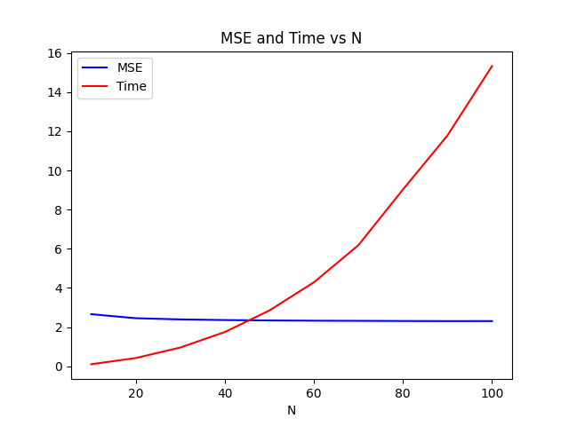
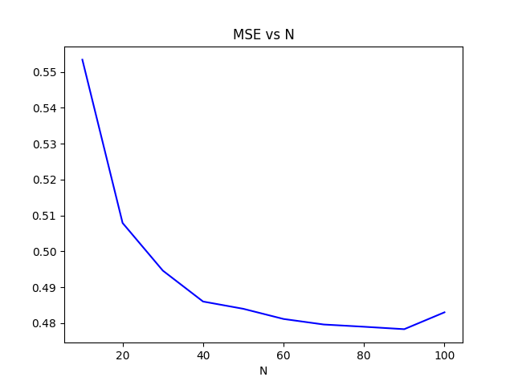

# Wifi Localization Performance Review

## Initial Attempt

### Assumptions
- Assume that the relation is $A w = x$

- Assume that the room is 10m x 10m

### Results
The following graph shows the relation between the number of samples and MSE as well as the time needed to find the optimal solution, MSE appears to decrease when increasing the number of samples but it stays around 2.5 m, so the gain from increasing the number of samples is very small

## Add Affine Term

### Assumptions
- Assume that the relation is $A w + B = x$

- Assume that the room is 10m x 10m

### Results
The following graph is the same as the previous one but here we neglect time because it is very similar, but MSE is reduces to about 0.5m, and standard deviation of about 0.25m.

